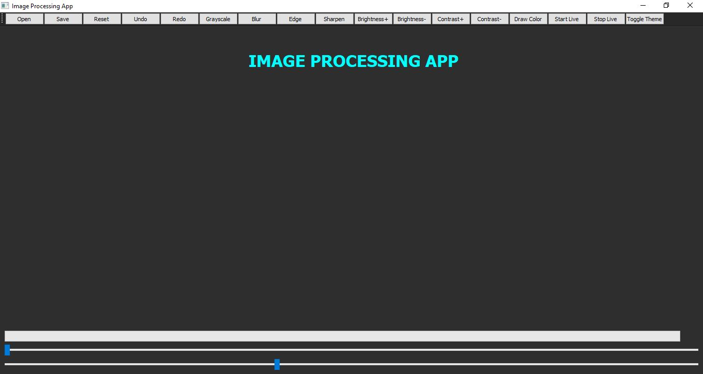
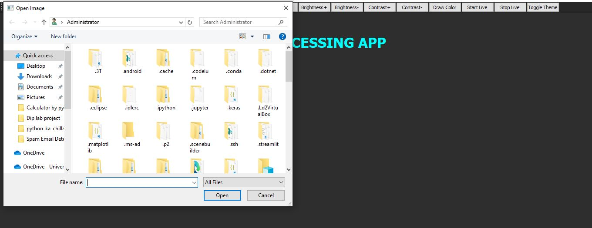
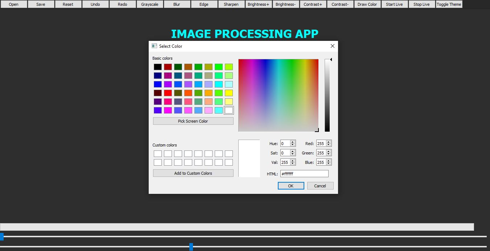

# 🖼️ PyQt5 Image Processing Application | Powered by OpenCV ⚙️  
      

🚀 The **PyQt5 Image Processing Application** is a professional desktop-based tool that seamlessly combines the simplicity of **PyQt5 GUI** with the powerful image processing capabilities of **OpenCV**. This project empowers users to perform real-time image manipulation, apply filters, draw on images, toggle between light and dark themes, and preview live webcam feeds — all through an intuitive, modern, and user-friendly interface.  

✨ **Key Features:** 🎞️ Real-time filters including blur, grayscale, sharpen, brightness, and contrast adjustments | ✏️ Drawing tools with customizable brush size and color | 🔄 Undo / Redo functionality for easy control | 🌗 Light & Dark theme toggle for personalized experience | 📸 Webcam capture and live editing | 🖱️ Drag & Drop image loading | 🧩 Smooth and responsive PyQt5 interface.  

🧠 **Tech Stack:**  
- **Language:** Python 🐍  
- **Framework:** PyQt5 🧩  
- **Library:** OpenCV 🎥  
- **IDE Recommended:** PyCharm / VS Code 💻  

📁 **Project Structure:**  
- `main.py` → Main entry point of the application  
- `assets/` → Contains interface preview images and icons  
- `modules/` → Core logic for filters, drawing tools, and UI handling  

🧑‍💻 **Author:** [Sayab Arshad](https://github.com/SayabArshad) 👨‍💻  
📅 **Version:** 1.0.0  
📜 **License:** MIT License  

🖼️ **Interface Previews:**  
  
  
  

💡 **About the Project:** This application demonstrates the perfect blend of GUI design and real-time image manipulation using OpenCV, built to enhance the user experience while providing full control over image editing operations. It serves as an excellent learning and development project for those interested in **computer vision**, **desktop app development**, and **PyQt5 GUI programming**.  

⭐ **Contributions:** Contributions are always welcome! You can fork the repository, submit issues, or open pull requests to enhance the functionality. If you find this project helpful, please give it a ⭐ to show your support.  

📧 **Contact:** For any inquiries, suggestions, or collaborations, feel free to reach out at **sayabarshad789@gmail.com**.  
